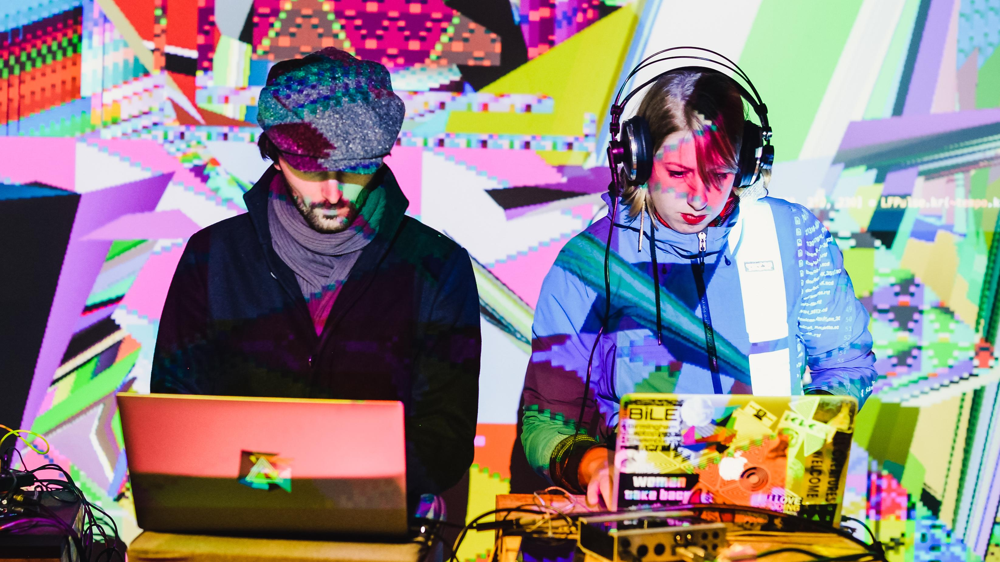

# L'intelligence articielle et les artistes
Ce billet de blog a été écrit suita à la présentation de Bernhard WAGNER : As an Artist, AI Is Your Assistant, Not Your Competitor!

Bernhard est un passioné de musique, professeur et un ingénieur logiciel. Dans cette présentation, il combine 2 de ces passions, la musique et l'ingénierie via l'intelligence articielle. 
Il essaye de répondre, de manière ludique _(c'est un professeur!)_, au problème suivant: **quelle est la place de l'intelligence artificielle dans le monde de l'art ?**

Certain artiste ont montré que c'est possible de travailler en symbiose avec cet nouvel outil.
C'est le cas de [Kris Kashtanova](https://kris.art), une artiste New-Yorkaise. Elle a réussi à obtenir des droits _(copyright)_ pour ces oeuvres. 

> **_NOTE:_** Elle a perdu les droits plus tard, elle les retrouve et ça tourne en boucle...

## Contexte en 2023
Autour de cette question, il faut contextualiser l'AI et toutes les contreverses :

* [28/01/2023] Procès de Microsoft avec le produit GitHub Copilot : [article The Verge](https://www.theverge.com/2023/1/28/23575919/microsoft-openai-github-dismiss-copilot-ai-copyright-lawsuit)
* [18/01/2023] Procès des artistes sur les oeuvres d'art générées par l'IA : [article de la BBC](https://www.bbc.com/news/technology-64285227)
* [18/01/2023] OpenAI utilise des travailleurs du Kenya pour 2$/heure pour que les réponses de ChatGPT3 soient moins toxiques : [article du Times](https://time.com/6247678/openai-chatgpt-kenya-workers/)

Ces articles et l'exemple de _Kris Kashtanova_ révèlent un problème de copyright : **Qui a les droits sur une oeuvre d'art générés par une IA ?**
Il ne faut pas oublier que l'IA utilise des exemples d'arts pour générer son oeuvre.

Dans le cadre de cette _keynote_ cette question ne sera _évidemment_ pas répondue.

## La musique comme illustration

Le terme *AlgoRave* qui permet des artistes de coder en live de la musique avec un autre artiste pour créer des visualisations : très [nerdy](https://www.thetimes.co.uk/article/algorave-the-nerdiest-clubbing-trend-of-them-all-h7hghst67).



Il existe donc des outils qui permettent de créer, improviser et de composer de la musique : 

* [tidalcycles](https://tidalcycles.org/) est un outil en _haskell_ qui permet de créer de la musique en live
* [hydra](https://github.com/ojack/hydra-sync) permet de créer des visualisations en live

## TidalCycles

Une bibliothèque de _pattern_ :

1. Un editeur texte (Vim)
2. Un interpreteur (Haskell)

Un moteur audio :

1. SuperDirt qui reçoit les messages et les transforment en son.
2. SuperCollider envoit les sons vers l'extérieur


Il est possible de s'amuser avec cet outil sans installation avec [strudel de tidalcycles](https://strudel.tidalcycles.org/).

```js
// https://strudel.tidalcycles.org/?OnNpCf7MzCie
note("c3 eb3 g3 bb3").palindrome()
.s('sawtooth')
.jux(x=>x.rev().color('green').s('sawtooth'))
.off(1/4, x=>x.add(note("<7 12>/2")).slow(2).late(.005).s('triangle'))
//.delay(.5)
.fast(1).cutoff(sine.range(200,2000).slow(8))
.decay(.05).sustain(0)
.room(.6)
.delay(.5).delaytime(.1).delayfeedback(.4)
.pianoroll()
```

## Intelligence Artificielle
ChatGPT3 connait TidalCycles. Il peut créer des visualisations en direct pour les compositions des artistes/compositeurs.
_p5js_ a été utilisé pour créer la visualisation.
Exemple sous [l'éditeur](https://editor.p5js.org/) :
```js
function setup() {
  createCanvas(400, 400);
}

function draw() {
  if (mouseIsPressed) {
    fill(0);
  } else {
    fill(255);
  }
  ellipse(mouseX, mouseY, 80, 80);
}
```

Cependant l'IA n'a aucune connaissance spatiale, donc, elle a besoin de l'aide de l'artiste.

## Conclusion 
L'IA est un outil et ne replacera pas les artistes.

## Mon avis
Le fond de la présentation est très intéressant. Les problèmes soulevés sont d'actualités et nous insiste à réflexion. La présentation s'est un peu attardée sur les outils pour faire du live coding et être DJ en même temps, cependant, le tout est resté très ludique tout en soulevant des problèmes de l'IA.

Je suis plus mitigé sur la conclusion du présentateur. Je pense aussi en effet que l'IA ne pourra jamais créer des oeuvres originales comme les artistes. Cependant, je comprends aussi que les artistes s'interroge, s'inquiète sur l'IA et leur apprentissage. L'IA a besoin d'exemple d'art. Quelles sont les oeuvres utilisés pour entraîner l'IA ? Cette influence devraît être documenté sur l'oeuvre finale généré par l'IA.

Finalement cette article et cette présentation m'a apporté plus de question que de réponse. En tout cas, cela a réveillé ma curiosité et j'ai hâte de voir la suite.

